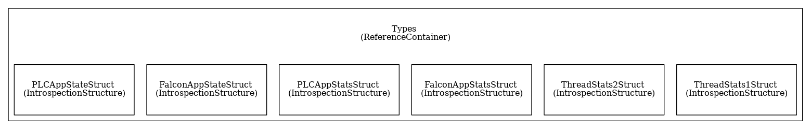

# Falcon Fast Data Acquisition

The Falcon *Fast Data Acquisition* acquires and stores data from an NI PXIe-6368 based system into an MDSplus pulse file (see \[F3.2.2\] in the [Falcon-Data-Storage](https://vcis-gitlab.f4e.europa.eu/aneto/Data-Storage-Falcon)). 

## Functions

The main functions of the Falcon *Fast Data Acquisition* are to:

* \[F3.2.2.1\] Acquire data from 16 ADC channels of an NI PXIe-6368 board (at 2 MHz);
* \[F3.2.2.2\] Downsample this data to 1 kHz and store it on MDSplus database against a given pulse number (pulse number be managed by the [Falcon-Data-Storage](https://vcis-gitlab.f4e.europa.eu/aneto/Data-Storage-Falcon));
* \[F3.2.1.3\] Generate a 1 kHz time base that is unique in the falcon plant (so that the [PON Sampler](https://vcis-gitlab.f4e.europa.eu/aneto/PON-Sampler-Falcon) data can be correlated against the fast data acquisition data);
* \[F3.2.2.4\] Store ADC data at 2 MHz in the MDSplus database, during limited time-windows, when triggered by a digital input of the NI PXIe-6368 board;
* \[F3.2.2.5\] Detect and store in the MDSplus database the time at which the experiment was started. This detection is performed by monitoring one of the ADC channels against a configurable threshold. No data shall be stored before this event is detected.;

These functions are implemented in the following components of a [MARTe2](https://vcis-gitlab.f4e.europa.eu/aneto/MARTe2) based application (see architecture below):

* \[F3.2.2.1\] in the [NI6368::NI6368ADC](https://vcis-gitlab.f4e.europa.eu/aneto/MARTe2-components/blob/develop/Source/Components/DataSources/NI6368/NI6368ADC.h);
* \[F3.2.2.2\]  in the [FilterDownsamplingGAM](https://vcis-gitlab.f4e.europa.eu/aneto/Fast-Control-Falcon/tree/develop/GAMs/FilterDownsamplingGAM) and in the [MDSWriter](https://vcis-gitlab.f4e.europa.eu/aneto/MARTe2-components/tree/develop/Source/Components/DataSources/MDSWriter) components.
* \[F3.2.2.3\] in the [FilterDownsamplingGAM](https://vcis-gitlab.f4e.europa.eu/aneto/Fast-Control-Falcon/tree/develop/GAMs/FilterDownsamplingGAM) and in the [SDN::SDNSubscriber](https://vcis-gitlab.f4e.europa.eu/aneto/MARTe2-components/tree/develop/Source/Components/DataSources/SDN) components;
* \[F3.2.2.4\] in the [NI6368::NI6368ADC](https://vcis-gitlab.f4e.europa.eu/aneto/MARTe2-components/blob/develop/Source/Components/DataSources/NI6368/NI6368ADC.h), in the [NI6368::NI6368DIO](https://vcis-gitlab.f4e.europa.eu/aneto/MARTe2-components/blob/develop/Source/Components/DataSources/NI6368/NI6368DIO.h), in the [TriggerMaskGAM](https://vcis-gitlab.f4e.europa.eu/aneto/Fast-Control-Falcon/blob/develop/GAMs/TriggerMaskGAM/TriggerMaskGAM.h) and in the [MDSWriter](https://vcis-gitlab.f4e.europa.eu/aneto/MARTe2-components/tree/develop/Source/Components/DataSources/MDSWriter) components;
* \[F3.2.2.5\] in the [NI6368::NI6368ADC](https://vcis-gitlab.f4e.europa.eu/aneto/MARTe2-components/blob/develop/Source/Components/DataSources/NI6368/NI6368ADC.h), in the [TimeCorrectionGAM](https://vcis-gitlab.f4e.europa.eu/aneto/Fast-Control-Falcon/blob/develop/GAMs/TimeCorrectionGAM/TimeCorrectionGAM.h) and in the [MDSWriter](https://vcis-gitlab.f4e.europa.eu/aneto/MARTe2-components/tree/develop/Source/Components/DataSources/MDSWriter) components;

## Networks

The following data acquisition networks are used by the *PON Sampler*:
* PON: to manage and monitor the *Fast Data Acqusition* state-machine;
* DAN: to store the acquired data. The traffic is MDSplus *mdsip*;
* SDN: to provide the data acquisition sampling time. The traffic is multicast UDP. (**note** that currently unicast traffic is being used. TODO update documentation when the switch configuration will allow for multicast)   

## Architecture

The *Fast Data Acquisition* is a MARTe2 based application with the following components:

* [EPICS::EPICSCAClient](https://vcis-gitlab.f4e.europa.eu/aneto/MARTe2-components/blob/develop/Source/Components/Interfaces/EPICS/EPICSCAClient.h): enables the configuration (currently limited to changing the state-machine state, i.e. a change of parameters, e.g. the number of signals, requires the restart of the application) and monitoring of the *Fast Data Acquisition* application;
* [LoggerService](https://vcis-gitlab.f4e.europa.eu/aneto/MARTe2/blob/master/Source/Core/Scheduler/L4LoggerService/LoggerService.h): stores in the machine *syslog* the *Fast Data Acquisition* application logging messages;
* [BaseLib2Wrapper](https://vcis-gitlab.f4e.europa.eu/aneto/MARTe2-components/blob/develop/Source/Components/Interfaces/BaseLib2Wrapper/BaseLib2Wrapper.h): allows to monitor the application using a web-browser;
* [StateMachine](https://vcis-gitlab.f4e.europa.eu/aneto/MARTe2/blob/master/Source/Core/Scheduler/L4StateMachine/StateMachine.h): allows to change the status of the real-time application;
* [RealTimeApplication](https://vcis-gitlab.f4e.europa.eu/aneto/MARTe2/blob/master/Source/Core/BareMetal/L5GAMs/RealTimeApplication.h): executes a sequence of components that implement all the functions described above.

### EPICS::EPICSCAClient

An EPICS::EPICSCAClient provides the interface between the *Fast Data Acquisition* state-machine and a set of EPICS variables.

The following PVs are used to interface with the application:

| PV | Type (R/W) | Value | Function |
| --- | ----- | ---- | ------ | 
| FALCON:FAST:STATUS | R     | 0    | Gets the current status of the application. When 0 the application is IDLE and no data is sent to MDSplus | 
| FALCON:FAST:STATUS | R     | 1    | Gets the current status of the application. When 1 the application is ACQUIRING and data is being sent to MDSplus |
| FALCON:FAST:STATUS_CMD | W     | 0    | Changes the current status of the application. When 0 the application is set to IDLE |
| FALCON:FAST:STATUS_CMD | W     | 1    | Changes the current status of the application. When 1 the application is set to ACQUIRING |
| FALCON:FAST:ERROR | R | 0 | Gets the current error status of the application. When 0 the application is running with no errors |
| FALCON:FAST:ERROR | R | 1 | Gets the current error status of the application. When 1 the application is in an error state |
| FALCON:FAST:ERROR_RST | W | 1 | Resets the application. If successful FALCON:FAST:ERROR will change to 0 |

### LoggerService

Sends the logging information to the console from where the service was started and to the system *syslog*. Information about the available logging can be found [here](https://vcis-gitlab.f4e.europa.eu/aneto/MARTe2/blob/develop/Source/Core/Scheduler/L4LoggerService/LoggerConsumerI.h).
 

### StateMachine

The application state-machine is managed by the FALCON:FAST:STATUS_CMD and FALCON:FAST:ERROR_RST PVs.

Upon every state change, a set of MARTe2 messages is triggered. In particular:

| From | To | Main actions |
| --- | ----- | ----- |
| INITIAL | IDLE | Starts the MARTe2 internal services. |
| IDLE | ACQUIRING | - Opens the MDSplus tree;   - Changes the RealTimeApplication to the Acquire state (see below);   - Sets FALCON:FAST:STATUS  to 1.    **Any error on the above will cause the state machine to go the ERROR state**.|
| ACQUIRING | IDLE | - Flushes the MDSplus tree with the latest acquired values;   - Changes the RealTimeApplication to the Idle state (see below);   - Sets FALCON:FAST:STATUS  to 0.    **Any error on the above will cause the state machine to go the ERROR state**.|
| * | ERROR | - Sets FALCON:FAST:ERROR to 1.   - Changes the RealTimeApplication to the Error state (ignoring any request to start an acquisition) |
| ERROR | IDLE | - Sets FALCON:FAST:ERROR to 0.   - Changes the RealTimeApplication to the Idle state (allowing to start an acquisition) |

### RealTimeApplication 

The *Fast Data Acquisition* is implemented as a MARTe RealTimeApplication. 

The application allows for three real-time states:
* Error: can be triggered by an internal error or by the StateMachine. In this state only the module that reads from the NI6368 data source is executed. 
* Idle: a module waits for 2000 samples to be ready from the NI6368 DataSource and makes it available to the following modules which will: i) get the latest digital input values from the  NI6368 DataSource; ii) transmit the cycle time to SDN; iii) downsample data to 1 kHz; iv) verify if a fast data acquisition trigger was requested by the digital inputs; and v) adjust the experiment time against the time at which the value of one of the ADC channels is greater than a given threshold. The two last modules have no real function in the *Idle* mode but were left to ease the debug of the application (using the BaseLib2GAM which allows to monitor these signals live). 
* Acquiring: as the Idle state but also executes the module that stores data in the MDSplus database.

The data interconnection in each of the states is defined in the following figures:
#### State = Idle

#### State = Acquiring

#### State = Error
