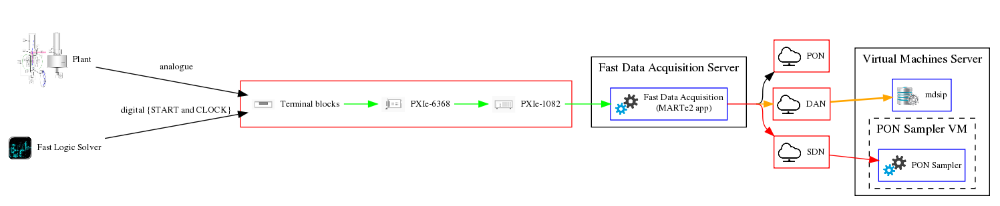
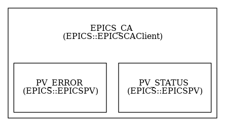
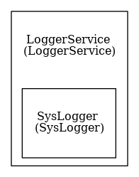
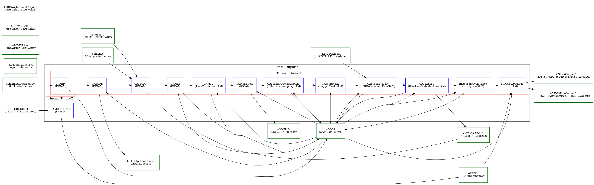
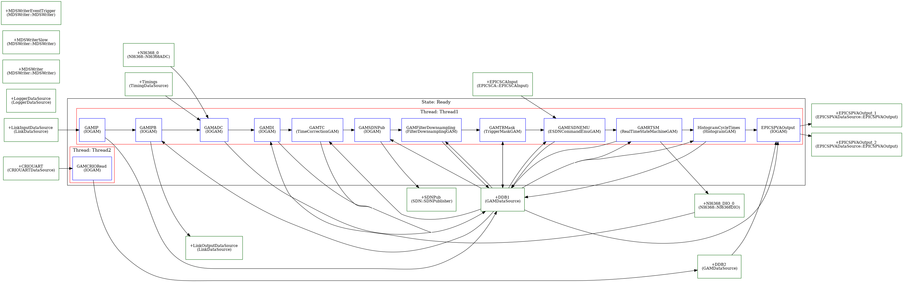
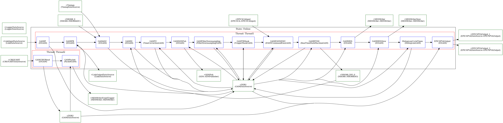
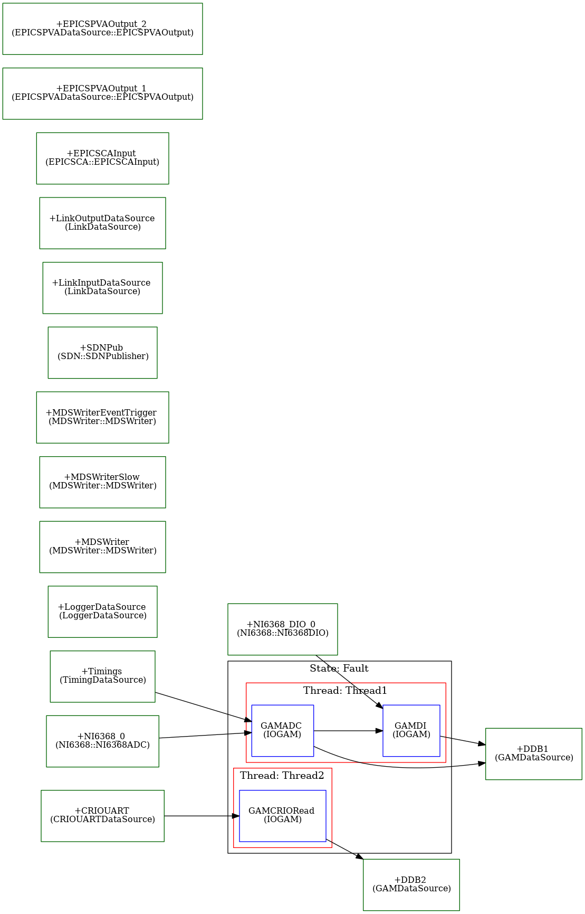

# Falcon Fast Data Acquisition

The Falcon *Fast Data Acquisition* acquires and stores data from an NI PXIe-6368 based system into an MDSplus pulse file (see \[F3.2.2\] in the [Falcon-Data-Storage](https://vcis-gitlab.f4e.europa.eu/aneto/Data-Storage-Falcon)). 



## Functions

The main functions of the Falcon *Fast Data Acquisition* are to:

* \[F3.2.2.1\] Acquire data from 16 ADC channels of an NI PXIe-6368 board (at 2 MHz);
* \[F3.2.2.2\] Downsample this data to 1 kHz and store it on MDSplus database against a given pulse number (pulse number be managed by the [Falcon-Data-Storage](https://vcis-gitlab.f4e.europa.eu/aneto/Data-Storage-Falcon));
* \[F3.2.2.3\] Generate a 1 kHz time base that is unique in the falcon plant (so that the [PON Sampler](https://vcis-gitlab.f4e.europa.eu/aneto/PON-Sampler-Falcon) data can be correlated against the fast data acquisition data);
* \[F3.2.2.4\] Store ADC data at 2 MHz in the MDSplus database, during limited time-windows, when triggered by a digital input of the NI PXIe-6368 board;
* \[F3.2.2.5\] Detect and store in the MDSplus database the time at which the experiment was started. This detection is performed by monitoring one of the ADC channels against a configurable threshold. No data shall be stored before this event is detected;
* \[F3.2.2.6\] Store CRIO events received through UART in the MDSplus database, when triggered by one of the received events;
* \[F3.2.2.7\] Request CRIO to enable power supply through digital signals generated by the NI PXIe-6368 board. The request will be configured through EPICS CA variables, and triggered by a digital signal from the NI PXIe-6368 board;
* \[F3.2.2.8\] Receive commands through SDN:
  * **CommandMakeReady**: controls Application State Machine
  * **CommandLoad**: loads power supply configuration (mode, gyrotron, and pulse duration)
  * **CommandStopPower**: stops requesting power supply
  * **CommandPutManualPower**: requests power supply if in Manual Mode
  * **CommandSuspend**: temporarily stops/resumes power supply procedure
  * **CommandAbort**: terminates power supply procedure and disables it until Application State Machine goes to Online state
* \[F3.2.2.9\] Publish current Application State on SDN;

These functions are implemented in the following components of a [MARTe2](https://vcis-gitlab.f4e.europa.eu/aneto/MARTe2) based application (see architecture below):

* \[F3.2.2.1\] in the [NI6368::NI6368ADC](https://vcis-gitlab.f4e.europa.eu/aneto/MARTe2-components/blob/develop/Source/Components/DataSources/NI6368/NI6368ADC.h);
* \[F3.2.2.2\] in the [FilterDownsamplingGAM](https://vcis-gitlab.f4e.europa.eu/aneto/Fast-Control-Falcon/tree/develop/GAMs/FilterDownsamplingGAM) and in the [MDSWriter](https://vcis-gitlab.f4e.europa.eu/aneto/MARTe2-components/tree/develop/Source/Components/DataSources/MDSWriter) components.
* \[F3.2.2.3\] in the [FilterDownsamplingGAM](https://vcis-gitlab.f4e.europa.eu/aneto/Fast-Control-Falcon/tree/develop/GAMs/FilterDownsamplingGAM) and in the [SDN::SDNSubscriber](https://vcis-gitlab.f4e.europa.eu/aneto/MARTe2-components/tree/develop/Source/Components/DataSources/SDN) components;
* \[F3.2.2.4\] in the [NI6368::NI6368ADC](https://vcis-gitlab.f4e.europa.eu/aneto/MARTe2-components/blob/develop/Source/Components/DataSources/NI6368/NI6368ADC.h), in the [NI6368::NI6368DIO](https://vcis-gitlab.f4e.europa.eu/aneto/MARTe2-components/blob/develop/Source/Components/DataSources/NI6368/NI6368DIO.h), in the [TriggerMaskGAM](https://vcis-gitlab.f4e.europa.eu/aneto/Fast-Control-Falcon/blob/develop/GAMs/TriggerMaskGAM/TriggerMaskGAM.h) and in the [MDSWriter](https://vcis-gitlab.f4e.europa.eu/aneto/MARTe2-components/tree/develop/Source/Components/DataSources/MDSWriter) components;
* \[F3.2.2.5\] in the [NI6368::NI6368ADC](https://vcis-gitlab.f4e.europa.eu/aneto/MARTe2-components/blob/develop/Source/Components/DataSources/NI6368/NI6368ADC.h), in the [TimeCorrectionGAM](https://vcis-gitlab.f4e.europa.eu/aneto/Fast-Control-Falcon/blob/develop/GAMs/TimeCorrectionGAM/TimeCorrectionGAM.h) and in the [MDSWriter](https://vcis-gitlab.f4e.europa.eu/aneto/MARTe2-components/tree/develop/Source/Components/DataSources/MDSWriter) components;
* \[F3.2.2.6\] in the [CRIOUARTDataSource](https://vcis-gitlab.f4e.europa.eu/aneto/Event-Recorder-Falcon/blob/develop/DataSources/CRIOUARTDataSource/CRIOUARTDataSource.h) and in the [MDSWriter](https://vcis-gitlab.f4e.europa.eu/aneto/MARTe2-components/tree/develop/Source/Components/DataSources/MDSWriter) components;
* \[F3.2.2.7\] in the [EPICSCA::EPICSCAInput](https://vcis-gitlab.f4e.europa.eu/aneto/MARTe2-components/blob/develop/Source/Components/DataSources/EPICSCA/EPICSCAInput.h), in the [ESDNCommandEmuGAM](https://vcis-gitlab.f4e.europa.eu/aneto/Fast-Control-Falcon/blob/develop/GAMs/ESDNCommandEmuGAM/ESDNCommandEmuGAM.h), in the [RealTimeStateMachineGAM](https://vcis-gitlab.f4e.europa.eu/aneto/Fast-Control-Falcon/blob/develop/GAMs/RealTimeStateMachineGAM/RealTimeStateMachineGAM.h) and in the [NI6368::NI6368DIO](https://vcis-gitlab.f4e.europa.eu/aneto/MARTe2-components/blob/develop/Source/Components/DataSources/NI6368/NI6368DIO.h) components;
* \[F3.2.2.8\] in the [SDNSubscriber](https://vcis-gitlab.f4e.europa.eu/aneto/MARTe2-components/blob/develop/Source/Components/DataSources/SDN/SDNSubscriber.h) and in the [TriggerOnChangeGAM](https://vcis-gitlab.f4e.europa.eu/aneto/MARTe2-components/blob/develop/Source/Components/GAMs/TriggerOnChangeGAM/TriggerOnChangeGAM.h) components;
* \[F3.2.2.9\] in the [SDNPublisher](https://vcis-gitlab.f4e.europa.eu/aneto/MARTe2-components/blob/develop/Source/Components/DataSources/SDN/SDNPublisher.h) component;

## Networks

The following data acquisition networks are used by the *PON Sampler*:
* PON: to manage and monitor the *Fast Data Acqusition* state-machine;
* DAN: to store the acquired data. The traffic is MDSplus *mdsip*;
* SDN: to provide the data acquisition sampling time. The traffic is multicast UDP. 

## Architecture

The *Fast Data Acquisition* is a MARTe2 based application with the following components:

* [LoggerService](https://vcis-gitlab.f4e.europa.eu/aneto/MARTe2/blob/master/Source/Core/Scheduler/L4LoggerService/LoggerService.h): stores in the machine *syslog* the *Fast Data Acquisition* application logging messages;
* [BaseLib2Wrapper](https://vcis-gitlab.f4e.europa.eu/aneto/MARTe2-components/blob/develop/Source/Components/Interfaces/BaseLib2Wrapper/BaseLib2Wrapper.h): allows to monitor the application using a web-browser;
* [StateMachine](https://vcis-gitlab.f4e.europa.eu/aneto/MARTe2/blob/master/Source/Core/Scheduler/L4StateMachine/StateMachine.h): allows to change the status of the real-time application;
* [RealTimeApplication](https://vcis-gitlab.f4e.europa.eu/aneto/MARTe2/blob/master/Source/Core/BareMetal/L5GAMs/RealTimeApplication.h): executes a sequence of components that implement all the functions described above.
* [EPICS::EPICSCAClient](https://vcis-gitlab.f4e.europa.eu/aneto/MARTe2-components/blob/develop/Source/Components/Interfaces/EPICS/EPICSCAClient.h): enables monitoring of the *Fast Data Acquisition* application;
* [NI6368::NI6368ADC](https://vcis-gitlab.f4e.europa.eu/aneto/MARTe2-components/blob/develop/Source/Components/DataSources/NI6368/NI6368ADC.h): reads analogic signals captured by NI6368;
* [NI6368::NI6368DIO](https://vcis-gitlab.f4e.europa.eu/aneto/MARTe2-components/blob/develop/Source/Components/DataSources/NI6368/NI6368DIO.h): reads/writes digital signals captured by NI6368;
* [CRIOUARTDataSource](https://vcis-gitlab.f4e.europa.eu/aneto/Event-Recorder-Falcon/blob/develop/DataSources/CRIOUARTDataSource/CRIOUARTDataSource.h): reads data sent by CRIO through UART;
* [SDNSubscriber](https://vcis-gitlab.f4e.europa.eu/aneto/MARTe2-components/blob/develop/Source/Components/DataSources/SDN/SDNSubscriber.h): subscribes to signals from SDN network;
* [SDNPublisher](https://vcis-gitlab.f4e.europa.eu/aneto/MARTe2-components/blob/develop/Source/Components/DataSources/SDN/SDNPublisher.h): publishes signals to SDN network;
* [EPICSPVAOutput](https://vcis-gitlab.f4e.europa.eu/aneto/MARTe2-components/blob/develop/Source/Components/DataSources/EPICSPVA/EPICSPVAOutput.h): writes EPICS records through PVA client protocol;
* [MDSWriter](https://vcis-gitlab.f4e.europa.eu/aneto/MARTe2-components/blob/develop/Source/Components/DataSources/MDSWriter/MDSWriter.h): writes signals to MDSplus database;
* [TriggerOnChangeGAM](https://vcis-gitlab.f4e.europa.eu/aneto/MARTe2-components/blob/develop/Source/Components/GAMs/TriggerOnChangeGAM/TriggerOnChangeGAM.h): triggers state machine events and/or RPC calls according to received commands;
* [TimeCorrectionGAM](https://vcis-gitlab.f4e.europa.eu/aneto/Fast-Control-Falcon/blob/develop/GAMs/TimeCorrectionGAM/TimeCorrectionGAM.h): monitors ADC signal that triggers experiment start. When signal is higher than threshold it sets 'boolean' signal and it corrects experiment time;
* [FilterDownsamplingGAM](https://vcis-gitlab.f4e.europa.eu/aneto/Fast-Control-Falcon/blob/develop/GAMs/FilterDownsamplingGAM/FilterDownsamplingGAM.h): filters and downsamples ADC signals;
* [ESDNCommandEmuGAM](https://vcis-gitlab.f4e.europa.eu/aneto/Fast-Control-Falcon/blob/develop/GAMs/ESDNCommandEmuGAM/ESDNCommandEmuGAM.h): emulates ESDN power-on command, and events RT_START and RT_STOP;
* [RealTimeStateMachineGAM](https://vcis-gitlab.f4e.europa.eu/aneto/Fast-Control-Falcon/blob/develop/GAMs/RealTimeStateMachineGAM/RealTimeStateMachineGAM.h): implements state machine that controls CRIOPulseStart and PowerSupplyTrigger signals;

### EPICS::EPICSCAClient

An EPICS::EPICSCAClient provides the interface between the *Fast Data Acquisition* state-machine and a set of EPICS variables.



The following PVs are used to monitor the application:

| PV | Type (R/W) | Value | Function |
| --- | ----- | ---- | ------ | 
| TEST-AUX-FDAQ:Fast_Status | R     | 0    | Gets the current status of the application. When 0 the application is NOT ONLINE and no data is sent to MDSplus | 
| TEST-AUX-FDAQ:Fast_Status | R     | 1    | Gets the current status of the application. When 1 the application is ONLINE and data is being sent to MDSplus |
| TEST-AUX-FDAQ:Fast_Error | R | 0 | Gets the current error status of the application. When 0 the application is running with no errors |
| TEST-AUX-FDAQ:Fast_Error | R | 1 | Gets the current error status of the application. When 1 the application is in an error state |

### EPICSPVA::EPICSPVADatabase

An EPICSPVA::EPICSPVADatabase service implements a database to store EPICSPVARecords regarding *Fast Data Acquisition* state and performance statistics.


The following EPICSPVARecords are stored:

| Alias | Type | Description |
| --- | ----- | ------ | 
| Falcon:Fast:Statistics | FalconAppStatsStruct | Contains performance data of FalconApp states| 
| Falcon:Fast:State | FalconAppStateStruct | Contains state data of FalconApp |
| Falcon:Fast:Statistics:PLC | PLCAppStatsStruct | Contains performance data of FalconApp states |
| Falcon:Fast:State:PLC | PLCAppStateStruct | Contains state data of PLCSDNApp |

<br/>
**-FalconAppStateStruct**

This type is used to communicate FalconApp state. In particular, it is composed by the following elements:

| Name | Type | Dimensions | Elements | Description |
| --- | ----- | ------ | ----- | ------ | 
| ESDNEvent | uint8 | 0 | 1 | Current event computed by the ESDNCommandEmuGAM. Possible values: <br/> - *RT_STOP*: 0; <br/> - *RT_START*: 1; | 
| ESDNPowerCommand | uint8 | 0 | 1 | Current power command issued by the ESDNCommandEmuGAM. Possible values: <br/> - *POWER_OFF*: 0; <br/> - *POWER_ON*: 1; |
| RTState | uint8 | 0 | 1 | Current state of the RealTimeStateMachineGAM. Possiblevalues: <br/> - *OFFLINE*: 120; <br/> - *ONLINE_OFF*: 240; <br/> - *ONLINE*: 225; <br/> - *CHANGE: 195*; <br/> - *END*: 135; <br/> - *PAUSED*: 210; |
| CRIOPacket | uint8 | 1 | 15 | Data packet with events as received from CRIO |

<br/>
**-PLCAppStateStruct**

This type is used to communicate PLCSDNApp state. In particular, it is composed by the following elements:

| Name | Type | Dimensions | Elements | Description |
| --- | ----- | ------ | ----- | ------ | 
| MARTeState | uint8 | 0 | 1 | Current state of MARTe state machine. Possible values: <br/> - *OFFPULSE*: 185; <br/> - *READY*: 140; <br/> - *ONLINE*: 225; <br/> - *FAULT*: 211; | 
| PLCSDNHeader | uint8 | 1 | 48 | Last value received on `Header` SDN signal subscription |
| PLCHeader | uint8 | 1 | 8 | Last value received on `PLCHeader` SDN signal subscription |
| PLCFloats | float32 | 0 | 1 | Last value received on `Floats` SDN signal subscription |
| PLCIntegers | uint16 | 1 | 1 | Last value received on `Integers` SDN signal subscription |
| CommandAbort | uint8 | 0 | 1 | Last command received on `CommandAbort` SDN signal subscription. Possible values: <br/> - *ABORT*: 165; |
| CommandLoad | uint8 | 0 | 1 | Last command received on `CommandLoad` SDN signal subscription. Possible values: <br/> - *LOAD*: 246; |
| CommandMakeReady | uint8 | 0 | 1 | Last command received on `CommandMakeReady` SDN signal subscription. Possible values: <br/> - *MAKE_READY*: 1; <br/> - *GO_ONLINE*: 2; <br/> - *GO_OFFPULSE*: 3 |
| CommandPutManualPower | uint8 | 0 | 1 | Last command received on `CommandPutManualPower` SDN signal subscription. Possible values: <br/> - *PUT_MANUAL_POWER*: 180; |
| CommandStopPower | uint8 | 0 | 1 | Last command received on `CommandStopPower` SDN signal subscription. Possible values: <br/> - *STOP_POWER*: 196; |
| CommandSuspend | uint8 | 0 | 1 | Last command received on `CommandSuspend` SDN signal subscription. Possible values: <br/> - *SUSPEND*: 170; <br/> - *RESUME*: 90; |
| PLCState | uint8 | 0 | 1 | Last value received on `PLCState` SDN signal subscription |
| PLCAlarms | uint8 | 0 | 1 | Last value received on `Alarms` SDN signal subscription |

### LoggerService

Sends the logging information to the system *syslog*. Information about the available logging can be found [here](https://vcis-gitlab.f4e.europa.eu/aneto/MARTe2/blob/develop/Source/Core/Scheduler/L4LoggerService/LoggerConsumerI.h).
 



### StateMachine

The application state-machine is managed by the SDN signal CommandMakeReady.


Upon every state change, a set of MARTe2 messages are triggered. In particular:

| From | To | Main actions |
| --- | ----- | ----- |
| INITIAL | OFFPULSE | Starts the MARTe2 internal services. |
| OFFPULSE | READY | - Opens the MDSplus tree; <br/> - Changes the RealTimeApplication to the Ready state (see below); <br/> - Publish change to Ready state on SDN. <br/><br/> **Any error on the above will cause the state machine to go the ERROR state**.|
| READY | ONLINE | - Changes the RealTimeApplication to the Online state (see below); <br/>  - Sets TEST-AUX-FDAQ:Fast_Status to 1; <br/> - Publish change to Online state on SDN. <br/><br/> **Any error on the above will cause the state machine to go the ERROR state**.|
| READY | OFFPULSE | - Flushes the MDSplus tree with the latest acquired values; <br/> - Changes the RealTimeApplication to the Offpulse state (see below); <br/> - Sets TEST-AUX-FDAQ:Fast_Status to 0; <br/> - Sets TEST-AUX-FDAQ:Error_Status to 0; <br/> - Publish change to Offpulse state on SDN. <br/><br/> **Any error on the above will cause the state machine to go the ERROR state**.|
| ONLINE | OFFPULSE | - Flushes the MDSplus tree with the latest acquired values; <br/> - Changes the RealTimeApplication to the Offpulse state (see below); <br/> - Sets TEST-AUX-FDAQ:Fast_Status to 0; <br/> - Sets TEST-AUX-FDAQ:Error_Status to 0; <br/> - Publish change to Offpulse state on SDN. <br/><br/> **Any error on the above will cause the state machine to go the ERROR state**.|
| * | FAULT | - Changes the RealTimeApplication to the Fault state (ignoring any request to start an acquisition); <br/> - Sets TEST-AUX-FDAQ:Fast_Status to 0; <br/> - Sets TEST-AUX-FDAQ:Fast_Error to 1; <br/> - Publish change to Fault state on SDN. |
| FAULT | OFFPULSE | - Changes the RealTimeApplication to the Offpulse state (allowing to start an acquisition); <br/> - Sets TEST-AUX-FDAQ:Fast_Error to 0; <br/> - Publish change to Offpulse state on SDN. <br/>|


### RealTimeApplication 

The *Fast Data Acquisition* is implemented as a MARTe RealTimeApplication. 

The application allows for four real-time states:
* Fault: can be triggered by an internal error or by the StateMachine. In this state only the module that reads from the NI6368 data source is executed. 
* Offpulse: a module waits for 2000 samples to be ready from the NI6368 DataSource and makes it available to the following modules which will: i) get the latest digital input values from the  NI6368 DataSource; ii) transmit the cycle time to SDN; iii) downsample data to 1 kHz; iv) verify if a fast data acquisition trigger was requested by the digital inputs; and v) adjust the experiment time against the time at which the value of one of the ADC channels is greater than a given threshold (i.e. against the time of the start of the experiment). The two last modules have no real function in the *Offpulse* mode but were left to ease the debug of the application (using the BaseLib2GAM which allows to monitor these signals live).
* Ready: 
* Online: as the Ready state but also executes modules that store data in the MDSplus database.

**Note regarding time**

The time base is given by the NI6368 module and is computed as *t = k x CT*, where *CT* is the cycle time and *k* is the cycle number. The NI6368 module will trigger a new cycle when *N* samples are available (the value of *N* can be configured by the user), so that *CT = N / Fs*. The sampling frequency (Fs) is fixed to 2 MHz. The current version of the application uses *N=2000* so that the *CT = 1e-3 s*. The cycle number is reset upon state change, so that when the application enter in the *Acquiring* state its value is set to 0 and thus the time is set to 0. 

Given that this state change occurs before the real start of the experiment, the time base has to be corrected so that *t_c = t - t_s*, where *t_c* is the corrected time that will be stored in MDSplus and *t_s* is the time at which the experiment started. Until the experiment starts no data is stored in MDSplus. This is possible by inhibiting a triggering signal in the MDSWriter module.

The time of the start of the experiment is given by the time at which the value of ADC is greater than a given threshold (in reality an assert mechanism verifies that this condition is kept true for a given number of samples)  *t_s = t + z / Fs*, where *z* is the sample number where *ADC[z] > threshold* and *ADC* is the channel being monitored.
  
The main components of the RealTimeApplication are:


| Name      | Type     | Function       | Configuration |
| --------- | -------- | ------------- | ---------|
| DDB1 | [GAMDataSource](https://vcis-gitlab.f4e.europa.eu/aneto/MARTe2/blob/develop/Source/Core/BareMetal/L5GAMs/GAMDataSource.h) | Allows to exchange data between the different GAM modules in Thread1 | None | 
| DDB2 | [GAMDataSource](https://vcis-gitlab.f4e.europa.eu/aneto/MARTe2/blob/develop/Source/Core/BareMetal/L5GAMs/GAMDataSource.h) | Allows to exchange data between the different GAM modules in Thread2 | None |
| Timings | [TimingDataSource](https://vcis-gitlab.f4e.europa.eu/aneto/MARTe2/blob/develop/Source/Core/BareMetal/L5GAMs/TimingDataSource.h) | Stores execution time of GAMs and thread states | None |
| LinkInputDataSource | [LinkDataSource](https://vcis-gitlab.f4e.europa.eu/aneto/MARTe2-components/blob/master/Source/Components/DataSources/LinkDataSource/LinkDataSource.h) | Allows to receive data from PLCSDNApp | None |
| LinkOutputDataSource | [LinkDataSource](https://vcis-gitlab.f4e.europa.eu/aneto/MARTe2-components/blob/master/Source/Components/DataSources/LinkDataSource/LinkDataSource.h) | Allows to send data to PLCSDNApp | None |
| NI6368_0 | [NI6368::NI6368ADC](https://vcis-gitlab.f4e.europa.eu/aneto/MARTe2-components/blob/develop/Source/Components/DataSources/NI6368/NI6368ADC.h) | Communicates with NI6368 to fetch captured analog signals | **DeviceName** = "/dev/pxie-6368" *//Device file location* <br/> **BoardId** = 0 *//The board identifier* <br/> **DMABufferSize** = 1000 *//Size of the DMA in bytes* <br/> **ClockSampleSource**=PFI0 *//Use INTERNALTIMING if no external clock is available* <br/> **CPUs** = 0x8 *//CPU affinity of the thread that reads data from the DMA channel* <br/> **RealTimeMode** = 1 *//Busy sleep on the semaphore that synchronises between the real-time thread and the thread which polls the DMA*  | 
| NI6368_DIO_0 | [NI6368::NI6368DIO](https://vcis-gitlab.f4e.europa.eu/aneto/MARTe2-components/blob/develop/Source/Components/DataSources/NI6368/NI6368DIO.h) | Communicates with NI6368 to set digital signals | **DeviceName** = "/dev/pxie-6368" *//Device file location* <br/> **BoardId** = 0 *//The board identifier* <br/> **InputPortMask** = 0x1 *//Each bit defines if the pin is an input (bit=0) or an output (bit=1).* <br/> **OutputPortMask** = 0x6 *//Each bit defines if the pin is an input (bit=0) or an output (bit=1).* <br/> **ClockSampleSource**=PFI0 *//Use INTERNALTIMING if no external clock is available* <br/> | 
| CRIOUART | [CRIOUARTDataSource](https://vcis-gitlab.f4e.europa.eu/aneto/Event-Recorder-Falcon/blob/develop/DataSources/CRIOUARTDataSource/CRIOUARTDataSource.h) | Receives data from CRIO through UART | **NumberOfBuffers** = 500 *//Size of FIFO between the real-time thread and the thread that reads data from the CRIO. The greater this value the lesser the likelihood that data will be lost. The greater this number the greater the memory consumption* <br/> **PortName** = "/dev/ttyUSB0" */Name of the UART port/* <br/> **BaudRate** = 115200 */BAUD UART rate/* <br/> **Timeout**=200000 */Maximum time waiting for data arrival before raising error/* <br/> **CPUMask** = 0x40 *//CPU affinity of the thread that reads data from the CRIO* | 
| SDNPub | [SDNPublisher](https://vcis-gitlab.f4e.europa.eu/aneto/MARTe2-components/blob/develop/Source/Components/DataSources/SDN/SDNPublisher.h) | Publishes data into the SDN network | **Topic** = FalconFast //*Name of the topic* <br/> **Interface** = em2 //*Name of the interface publishing the SDN traffic* |
| EPICSCAInput | [EPICSCAInput](https://vcis-gitlab.f4e.europa.eu/aneto/MARTe2-components/blob/develop/Source/Components/DataSources/EPICSCA/EPICSCAInput.h) | Reads EPICS PVs through channel access client protocol | **StackSize** = 1048576 //*Stack size of the thread that asynchronously reads data* <br/> **CPUs** = 0x2 *//CPU affinity of the thread that asynchronously reads data*|
| EPICSPVAOutput_1 | [EPICSPVAOutput](https://vcis-gitlab.f4e.europa.eu/aneto/MARTe2-components/blob/develop/Source/Components/DataSources/EPICSPVA/EPICSPVAOutput.h) | Writes EPICS record with threads performance statistics through PVA client protocol | **StackSize** = 1048576 //*Stack size of the thread that asynchronously writes data* <br/> **CPUs** = 0x2 *//CPU affinity of the thread that asynchronously writes data* <br/> **IgnoreBufferOverrun** = 1 *//Do not raise error when buffer is not writing data fast enough* <br/> **NumberOfBuffers** = 10 *//Size of FIFO between the real-time thread and the thread that asynchronously writes records. The greater this value the lesser the likelihood that data will be lost. The greater this number the greater the memory consumption*|
| EPICSPVAOutput_2 | [EPICSPVAOutput](https://vcis-gitlab.f4e.europa.eu/aneto/MARTe2-components/blob/develop/Source/Components/DataSources/EPICSPVA/EPICSPVAOutput.h) | Writes EPICS record with ESDN-RTSM state through PVA client protocol | **StackSize** = 1048576 //*Stack size of the thread that asynchronously writes data* <br/> **CPUs** = 0x2 *//CPU affinity of the thread that asynchronously writes data* <br/> **IgnoreBufferOverrun** = 1 *//Do not raise error when buffer is not writing data fast enough* <br/> **NumberOfBuffers** = 10 *//Size of FIFO between the real-time thread and the thread that asynchronously writes records. The greater this value the lesser the likelihood that data will be lost. The greater this number the greater the memory consumption*|
| MDSWriter | [MDSWriter](https://vcis-gitlab.f4e.europa.eu/aneto/MARTe2-components/blob/develop/Source/Components/DataSources/MDSWriter/MDSWriter.h) | Stores data in the MDSplus database | **NumberOfBuffers** = 60000 //*Size of FIFO between the real-time thread and the thread that asynchronously stores data in MDSplus. The greater this value the lesser the likelihood that data will be lost. The greater this number the greater the memory consumption* <br/> **CPUMask** = 0x10 *//CPU affinity of the thread that asynchronously stores data in MDSplus* <br/>**StackSize** = 10000000 *//Stack size of the thread that asynchronously stores data in MDSplus. WARNING: do not lower this value too much as stack memory corruption might occur on the MDSplus library* <br/> **TreeName** = falcon_fast *//Name of the MDSplus tree where data is to be stored* <br/> **StoreOnTrigger** = 1 *//Only store data when the trigger signal is 1 (The trigger signal must be the first signal in the Signals section and must have type uint8). This signal is generated by the TimeCorrectionGAM* <br/> **EventName** = "updatejScope" *//Name of the MDSplus event to fire at a given period. This can be used to e.g. refresh jScope* <br/> **TimeRefresh** = 5 *//Period, in seconds, at which the MDSplus event should be fired* |  
| MDSWriterSlow | [MDSWriter](https://vcis-gitlab.f4e.europa.eu/aneto/MARTe2-components/blob/develop/Source/Components/DataSources/MDSWriter/MDSWriter.h) | Stores the downsampled data in the MDSplus database | **NumberOfBuffers** = 120000 //*Size of FIFO between the real-time thread and the thread that asynchronously stores data in MDSplus. The greater this value the lesser the likelihood that data will be lost. The greater this number the greater the memory consumption* <br/> **CPUMask** = 0x10 *//CPU affinity of the thread that asynchronously stores data in MDSplus* <br/>**StackSize** = 10000000 *//Stack size of the thread that asynchronously stores data in MDSplus. WARNING: do not lower this value too much as stack memory corruption might occur on the MDSplus library* <br/> **TreeName** = falcon_fast *//Name of the MDSplus tree where data is to be stored* <br/> **StoreOnTrigger** = 1 *//Only store data when the trigger signal is 1 (The trigger signal must be the first signal in the Signals section and must have type uint8). This signal is generated by the TimeCorrectionGAM* <br/> **EventName** = "updatejScope" *//Name of the MDSplus event to fire at a given period. This can be used to e.g. refresh jScope* <br/> **TimeRefresh** = 5 *//Period, in seconds, at which the MDSplus event should be fired* |  
| MDSWriterEventTrigger | [MDSWriter](https://vcis-gitlab.f4e.europa.eu/aneto/MARTe2-components/blob/develop/Source/Components/DataSources/MDSWriter/MDSWriter.h) | Stores triggered events in the MDSplus database | **NumberOfBuffers** = 5000 //*Size of FIFO between the real-time thread and the thread that asynchronously stores data in MDSplus. The greater this value the lesser the likelihood that data will be lost. The greater this number the greater the memory consumption* <br/> **CPUMask** = 0x10 *//CPU affinity of the thread that asynchronously stores data in MDSplus* <br/>**StackSize** = 10000000 *//Stack size of the thread that asynchronously stores data in MDSplus. WARNING: do not lower this value too much as stack memory corruption might occur on the MDSplus library* <br/> **TreeName** = falcon_event *//Name of the MDSplus tree where data is to be stored* <br/> **StoreOnTrigger** = 1 *//Only store data when the trigger signal is 1 (The trigger signal must be the first signal in the Signals section and must have type uint8). This signal is generated by the TimeCorrectionGAM* <br/> **EventName** = "updatejScope" *//Name of the MDSplus event to fire at a given period. This can be used to e.g. refresh jScope* <br/> **TimeRefresh** = 5 *//Period, in seconds, at which the MDSplus event should be fired* |  
| GAMIP | [IOGAM](https://vcis-gitlab.f4e.europa.eu/aneto/MARTe2-components/blob/develop/Source/Components/GAMs/IOGAM/IOGAM.h) | Reads data from LinkInputDataSource and makes it available on the DDB1 | None
| GAMIPB | [IOGAM](https://vcis-gitlab.f4e.europa.eu/aneto/MARTe2-components/blob/develop/Source/Components/GAMs/IOGAM/IOGAM.h) | Writes the signals to be strored in the LinkOutputDataSource | None
| GAMADC | [IOGAM](https://vcis-gitlab.f4e.europa.eu/aneto/MARTe2-components/blob/develop/Source/Components/GAMs/IOGAM/IOGAM.h) | Reads data from the NI6368_0 and makes it available on the DDB1 | In at **most one** signal: **Frequency** = 1000 *//Period in micro-seconds at which the thread is expected to cycle.*<br/> In **all** signals **Samples** = 2000 *//Number of samples to be read for a given channel. Must be the same in all channels and (Samples x Frequency == 2000000)*<br/>
| GAMDI | [IOGAM](https://vcis-gitlab.f4e.europa.eu/aneto/MARTe2-components/blob/develop/Source/Components/GAMs/IOGAM/IOGAM.h) | Reads data from the NI6368_DIO_0 and makes it available on the DDB1 | None <br/>
| GAMTC | [TimeCorrectionGAM](https://vcis-gitlab.f4e.europa.eu/aneto/Fast-Control-Falcon/blob/develop/GAMs/TimeCorrectionGAM/TimeCorrectionGAM.h) | Detects if the experiment has started by comparing the value of the input ADC signal against a given threshold. Until the experiment is started the time is not corrected and the output trigger signal is inhibited. While the trigger is inhibited no data is stored in MDSplus.| **AssertCycles** = 3 *//Number of cycles during which the value of the ADC shall be greater than the Threshold so that the experiment can be considered as started* <br/> **Threshold** = 1000 *//The Threshold in ADC units* <br/> **SignalPeriod** = 500e-9 *//The input signal period* |
| GAMSDNPub | [IOGAM](https://vcis-gitlab.f4e.europa.eu/aneto/MARTe2-components/blob/develop/Source/Components/GAMs/IOGAM/IOGAM.h) | Writes the signals to be published in the SDNPub DataSource | None |
| GAMFilterDownsampling | [FilterDownsamplingGAM](https://vcis-gitlab.f4e.europa.eu/aneto/Fast-Control-Falcon/blob/develop/GAMs/FilterDownsamplingGAM/FilterDownsamplingGAM.h) | Filters and downsamples the ADC data | **SamplingFrequency** = 2000000 *//Frequency of the signals to be filtered* <br/> **CutOffFrequency** = 200 *//Filter cut-off frequency* <br/>  For every output signal **Gain**=3.15e-04 *//Gain to apply to every output signal. Output signals are float32*|
| GAMTRMask | [TriggerMaskGAM](https://vcis-gitlab.f4e.europa.eu/aneto/Fast-Control-Falcon/blob/develop/GAMs/TriggerMaskGAM/TriggerMaskGAM.h) | Masks the input signal and if the value is not zero outputs the value 1 in the output signal, 0 otherwise | **Mask** = 0x1 *//The mask to apply against the input signal*|
| GAMESDNEMU | [ESDNCommandEmuGAM](https://vcis-gitlab.f4e.europa.eu/aneto/Fast-Control-Falcon/blob/develop/GAMs/ESDNCommandEmuGAM/ESDNCommandEmuGAM.h) | Emulates ESDN power-on command, and events RT_START and RT_STOP | **PowerDelayTime** = 100000 *//micro-seconds before sending power ON command* <br/> **RTStopTime** = 3600000000 *//micro-seconds before stop sending power ON command* <br/> **Offline** = 120 *//Offline state ID* <br/> **OnlineOff** = 240 *//OnlineOff state ID* <br/> **RTStartEvent** = 1 *//RT_START event ID* <br/> **RTStopEvent** = 0 *//RT_STOP event ID* <br/> **PowerOnCommand** = 1 *//Power ON command ID* <br/> **PowerOffCommand** = 0 *//Power OFF command ID* <br/>|
| GAMRTSM | [RealTimeStateMachineGAM](https://vcis-gitlab.f4e.europa.eu/aneto/Fast-Control-Falcon/blob/develop/GAMs/RealTimeStateMachineGAM/RealTimeStateMachineGAM.h) | Enables CRIOPulseStart and/or PowerSupplyTrigger as required by current state | **Offline** = 120 *//Offline state ID* <br/> **OnlineOff** = 240 *//OnlineOff state ID* <br/> **Online** = 225 *//Online state ID* <br/> **Change** = 195 *//Change state ID* <br/> **End** = 135 *//End state ID* <br/> **Paused** = 210 *//Paused state ID* <br/> **OnlineMainStateMachine** = "Online" *//MARTe online state ID* <br/> **SDNRTStart** = 1 *//RT_START event ID* <br/> **SDNRTStop** = 0 *//RT_STOP event ID* <br/> **SDNPowerOn** = 1 *//Power ON command ID* <br/> **CRIOPulseStart** = 2 *//Value used to enable CRIO pulse start* <br/> **PowerSupplyTrigger** = 4 *//Value used to enable Power Supply* <br/> |
| GAMMDS | [IOGAM](https://vcis-gitlab.f4e.europa.eu/aneto/MARTe2-components/blob/develop/Source/Components/GAMs/IOGAM/IOGAM.h) | Writes the signals to be stored in the MDSWriter DataSource | None |
| GAMMDSSlow | [IOGAM](https://vcis-gitlab.f4e.europa.eu/aneto/MARTe2-components/blob/develop/Source/Components/GAMs/IOGAM/IOGAM.h) | Writes the signals to be stored in the MDSWriterSlow DataSource | None |
| HistogramCycleTimes | [HistogramGAM](https://vcis-gitlab.f4e.europa.eu/aneto/MARTe2-components/blob/develop/Source/Components/GAMs/HistogramGAM/HistogramGAM.h) | Computes histogram with cycle times of both threads | **BeginCycleNumber**=10 *//Start computing histogram after 10 cycles.* <br/> **StateChangeResetName** = All *//Reset histogram after any state change.* |
| EPICSPVAOutput | [IOGAM](https://vcis-gitlab.f4e.europa.eu/aneto/MARTe2-components/blob/develop/Source/Components/GAMs/IOGAM/IOGAM.h) | Writes the signals to be stored in the EPICSPVAOutput DataSource | None |
| GAMCRIORead | [IOGAM](https://vcis-gitlab.f4e.europa.eu/aneto/MARTe2-components/blob/develop/Source/Components/GAMs/IOGAM/IOGAM.h) | Reads data from the CRIOUART and makes it available on the DDB2 | None |
| GAMPacket | [PacketGAM](https://vcis-gitlab.f4e.europa.eu/aneto/Event-Recorder-Falcon/blob/develop/GAMs/PacketGAM/PacketGAM.h) | Ensures correctness of packet and extracts content into different signals | None |

The data interconnection in each of the states is defined in the following figures:
#### State = Offpulse


#### State = Ready


#### State = Online


#### State = Fault



## Installation

### Linux setup
 
1. Edit the inittab file and change *id:5:initdefault:* to *id:3:initdefault:* 
 
```
su
vim /etc/inittab
exit
```

2. Disable unused services

```
su
setup
```

Disable the following services:

* bluetooth
* ip6tables
* iptables
* postgresql-9.3
* CTRL-*
* MAG-*
* TEST-*
* sup-*
* css-*

```
OK->Quit
```

3. Reboot

### MDSplus

1. Log-in as *codac-dev* to the Fast Controller 1 server (10.136.50.30).
2. Install the [MDSplus alpha version](http://www.mdsplus.org/index.php/Latest_RPM%27s_and_Yum_repositories)
3. Install the mdsplus-alpha libraries
 
```
yum install mdsplus-alpha
yum install mdsplus-alpha-devel
yum install mdsplus-alpha-java
yum install mdsplus-alpha-kernel
yum install mdsplus-alpha-python
```
 
4. Edit the file /etc/mdsplus.conf and write:

```
falcon_path 10.136.30.21:8000::/raiddata/mdsplus/trees
falcon_conf_path 10.136.30.21:8000::/raiddata/mdsplus/trees
falcon_mon_path 10.136.30.21:8000::/raiddata/mdsplus/trees
falcon_fast_path 10.136.30.21:8000::/raiddata/mdsplus/trees
falcon_trend_path 10.136.30.21:8000::/raiddata/mdsplus/trees
```

**Note** it is assumed that the falcon_fast tree was created as described in the [Falcon-Data-Storage](https://vcis-gitlab.f4e.europa.eu/aneto/Data-Storage-Falcon) procedure.

### *Fast Data Acquisition* and dependencies

#### Procedure

1. Log-in as *codac-dev* to the Fast Controller 1 server (10.136.50.30).

2. Download the source code 

```
cd ~
mkdir Projects
cd ~Projects
git clone https://vcis-gitlab.f4e.europa.eu/aneto/MARTe2.git MARTe2-dev
git clone https://vcis-gitlab.f4e.europa.eu/aneto/MARTe2-components.git
cd MARTe2-components
git checkout develop
cd ..
git clone https://aneto@vcis-gitlab.f4e.europa.eu/aneto/Fast-Control-Falcon.git
cd Fast-Control-Falcon
git checkout develop
cd -
mkdir EFDA-MARTe
cd EFDA-MARTe
svn co https://efda-marte.ipfn.ist.utl.pt/svn/EFDA-MARTe/trunk/
cd ..
```

**Note** Replace aneto with your username.

3. Compile the source code

```
export MARTe2_DIR=/home/codac-dev/Projects/MARTe2-dev/
export MARTe2_Components_DIR=/home/codac-dev/Projects/MARTe2-components/
export EFDA_MARTe_DIR=/home/codac-dev/Projects/EFDA-MARTe/trunk/

cd $EFDA_MARTe_DIR
./compile.MARTe linux config.MARTe
cd GAMs/TypeConvertGAM/
make -f Makefile.linux
cd ../../Interfaces/BaseLib2Adapter/
make -f Makefile.linux

cd $MARTe2_DIR
make -f Makefile.linux

cd $MARTe2_Components_DIR
make -f Makefile.linux
cd -

cd ~/Projects/Fast-Control-Falcon
make -f Makefile.linux
cd -
```


### Service

1. Create the service

```
su
ln -s /home/codac-dev/Projects/Fast-Control-Falcon/Startup/MARTeService /etc/init.d/
/sbin/chkconfig --level 3 MARTeService on
/sbin/chkconfig --level 5 MARTeService on
/etc/init.d/MARTeService restart
exit 
```


## Current deployment
 
| Server             | IP            | Service                                 | Restart command | Log |
| ------             | ---           | ------                                  | ------- | --- |
| Fast Controller 1  | 10.136.50.30 (SSH) <br/> 10.136.100.27 (PON) <br/> 10.136.20.21 (SDN) <br/> 10.136.30.23 (DAN)| *MARTeService* | /etc/init.d/MARTeService restart | /var/log/messages | 

Note that the DAN interface is a 2 Gb link aggregation of two ports:

ifcfg-bond0
```
DEVICE=bond0
BOOTPROTO=none
IPADDR="10.136.30.23"
NETMASK="255.255.255.0"
NM_CONTROLLED="yes"
ONBOOT="yes"
TYPE=Bond
BONDING_MASTER=yes
```

ifcfg-eth4
```
DEVICE=eth4
BOOTPROTO=none
ONBOOT=yes
MASTER=bond0
SLAVE=yes
USERCTL=no
NM_CONTROLLED=yes
```

ifcfg-eth5
```
DEVICE=eth5
BOOTPROTO=none
ONBOOT=yes
MASTER=bond0
SLAVE=yes
USERCTL=no
NM_CONTROLLED=yes
```

## Maintenance

### Changing the MDSplus signal names

1- Change the signal names in MDSplus and regenerate the tree as described in the procedures of [Falcon-Data-Storage](https://vcis-gitlab.f4e.europa.eu/aneto/Data-Storage-Falcon). 

Note that the fast signal names are defined in the [CreateFalconMDSPlusFastTree.tcl file](https://vcis-gitlab.f4e.europa.eu/aneto/Data-Storage-Falcon/blob/master/Tools/CreateFalconMDSPlusFastTree.tcl). **Remember to commit and push any changes to this file!**


2- Copy the latest version of the Startup configuration file

```
cd ~/Projects/Fast-Control-Falcon/Configuration
cp Startup.cfg NewConfiguration.cfg
```

**Note:** the *NewConfiguration.cfg* can be any file name and **shall be commited and pushed to the vcis server**.

3- In the MDSWriter and MDSWriterSlow signals edit the *NodeName* fields accordingly to what was set in the [CreateFalconMDSPlusFastTree.tcl file](https://vcis-gitlab.f4e.europa.eu/aneto/Data-Storage-Falcon/blob/master/Tools/CreateFalconMDSPlusFastTree.tcl)

4- Create the link to the Startup file.

```
rm Startup.cfg
ln -s /home/codac-dev/Projects/Fast-Control-Falcon/Configuration/NewConfiguration.cfg /home/codac-dev/Projects/Fast-Control-Falcon/Configuration/Startup.cfg
``` 

5- Restart the service

```
su
/etc/init.d/MARTeService restart
exit 
```

## Troubleshooting

TODO